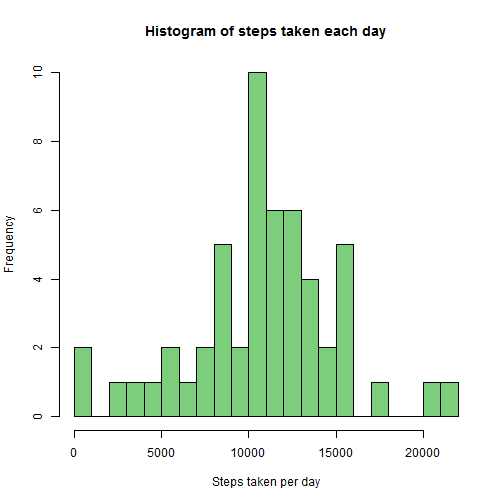
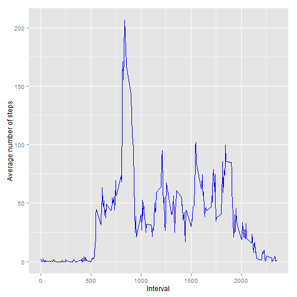
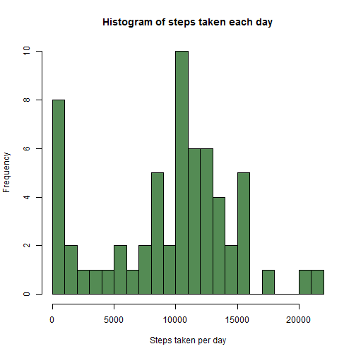
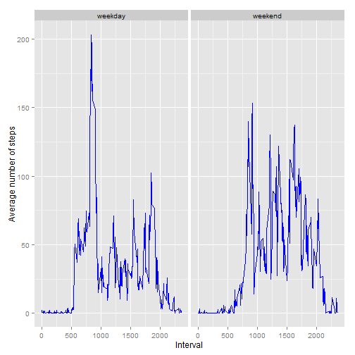

## Loading and preprocessing the data

This script assumes that the "repdata-data-activity.zip" file is present in the working directory.


```r
library(ggplot2)
library(dplyr)
library(lubridate)

options(scipen = 6)

# Set the locale for date and time functions
Sys.setlocale("LC_TIME", "English")
```

```
## [1] "English_United States.1252"
```

```r
if (!file.exists("activity.csv"))
        unzip("repdata-data-activity.zip")

rawData <- read.csv("activity.csv")
data <- rawData %>%
    mutate(date = ymd(date))
```

## What is mean total number of steps taken per day?

First I create a new data frame with the aggregated number of steps by day. If a day has at least one interval with missing values, all data from that day is removed from the aggregated data frame. The reasoning behind this step is that if I see a day with a small number of steps, then there actually was a small number of steps on that day, 


```r
totalStepsPerDay <- data %>%
    select(steps, date) %>%
    group_by(date) %>%
    summarise(steps = sum(steps)) %>%
    filter(complete.cases(.))
```

Histogram of the total number of steps taken each day:


```r
hist(totalStepsPerDay$steps, breaks=20, col="palegreen3",
     main="Histogram of steps taken each day", 
     xlab="Steps taken per day")
```

 

Computing the mean and median:


```r
totalStepsPerDayMean <- round(mean(totalStepsPerDay$steps))
```

The mean total number of steps taken per day is 10766.


```r
totalStepsPerDayMedian <- median(totalStepsPerDay$steps)
```

The median total number of steps taken per day is 10765.


## What is the average daily activity pattern?

The following code computes the average daily activity pattern. Because there are missing values in each interval, for each interval the missing values are ignored when computing the mean number of steps.


```r
averageDailyPattern <- data %>%
    select(interval, steps) %>%
    group_by(interval) %>%
    summarise(steps = mean(steps, na.rm = T))
```

Time series plot:


```r
ggplot(averageDailyPattern, aes(interval, steps)) + 
    geom_line(colour="blue") +
    xlab("Interval") + 
    ylab("Average number of steps")
```

 


```r
maxStepsInterval <- averageDailyPattern$interval[which.max(averageDailyPattern$steps)]
```

The interval with the maximum number of steps is 835.

## Imputing missing values


```r
completeRows <- complete.cases(data)
nrRowsWithNA <- sum(!completeRows)
summary(data)
```

```
##      steps             date               interval     
##  Min.   :  0.00   Min.   :2012-10-01   Min.   :   0.0  
##  1st Qu.:  0.00   1st Qu.:2012-10-16   1st Qu.: 588.8  
##  Median :  0.00   Median :2012-10-31   Median :1177.5  
##  Mean   : 37.38   Mean   :2012-10-31   Mean   :1177.5  
##  3rd Qu.: 12.00   3rd Qu.:2012-11-15   3rd Qu.:1766.2  
##  Max.   :806.00   Max.   :2012-11-30   Max.   :2355.0  
##  NA's   :2304
```

The number of rows with NAs is 2304. As we can see from the summary output, all the NA values are in the steps column.

To fill the missing values in the dataset, I will use the means for each of the 5-minute intervals for every weekday. For example, if there is a mssing value in interval 0 on Monday, it will be imputed with the mean for interval 0 on all Mondays in the dataset for which we have data.


```r
completeData <- data[completeRows, ]
incompleteData <- data[!completeRows, ]

weekdayIntervalMeans <- completeData %>%
    mutate(weekday = wday(date)) %>%
    group_by(weekday, interval) %>%
    summarise(steps = mean(steps))

getMeanSteps <- function(date, interval) {
    weekdayIntervalRow <- weekdayIntervalMeans %>% 
        filter(weekday == wday(date) & interval == interval)
    first(weekdayIntervalRow$steps)
}

# Use the means to fill in the steps for the rows with missing values
for (i in 1:nrow(incompleteData)) {
    incompleteData[i, "steps"] <- getMeanSteps(incompleteData[i, "date"], incompleteData[i, "interval"])
}

imputedData <- rbind(completeData, incompleteData)

# Compute the total steps per day for the imputed dataset
totalStepsPerDay.imputed <- imputedData %>%
    select(steps, date) %>%
    group_by(date) %>%
    summarise(steps = sum(steps))
```

Histogram of the total number of steps taken each day:


```r
hist(totalStepsPerDay.imputed$steps, breaks=20, col="palegreen4",
     main="Histogram of steps taken each day", 
     xlab="Steps taken per day")
```

 

Computing the mean and median for the imputed dataset:


```r
totalStepsPerDayMean.imputed <- round(mean(totalStepsPerDay.imputed$steps))
```

The mean total number of steps taken per day is 9416.


```r
totalStepsPerDayMedian.imputed <- median(totalStepsPerDay.imputed$steps)
```

The median total number of steps taken per day is 10395.

Because most of the NAs were in intervals where the value was low, the mean for the imputed data is lower than the mean obtained when I ignored the days with missing values. This is an example of a dataset where the missing values are correlated with the values of a variable.

## Are there differences in activity patterns between weekdays and weekends?

Creating the weekday factor and adding it to the imputed data frame:


```r
imputedDataWeekend <- imputedData %>%
    mutate(weekend = as.factor(ifelse(wday(date, label = T) %in% c("Sat", "Sun"), "weekend", "weekday")))

dailyPatternWeekend <- imputedDataWeekend %>%
    select(weekend, interval, steps) %>%
    group_by(weekend, interval) %>%
    summarise(steps = mean(steps))
```

Plotting the average number of steps for each interval for weekday days and
weekend days:


```r
ggplot(dailyPatternWeekend, aes(interval, steps)) + 
    facet_grid(. ~ weekend) +
    geom_line(colour="blue") +
    xlab("Interval") + 
    ylab("Average number of steps")
```

 

We can see that the weekdays have a period in which the average number of steps taken is high, which could be the start of the work day in the morning. The mean number of steps per interval is higher in the weekend, especially in the latter part of the day.

These results may not be precise because I have used a simple method for replacing NAs that used the reported values to estimate the missing ones and might be influenced by a sampling bias(like only large values being reported).
