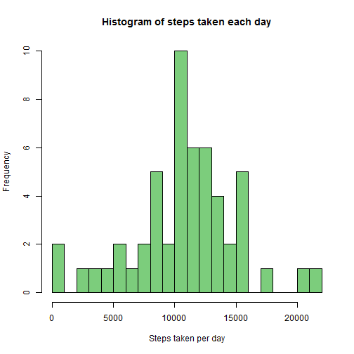
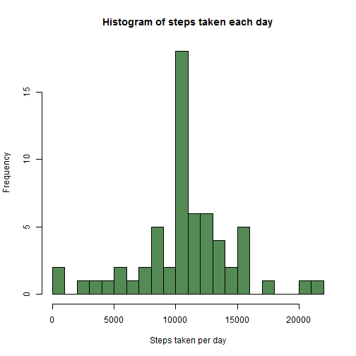
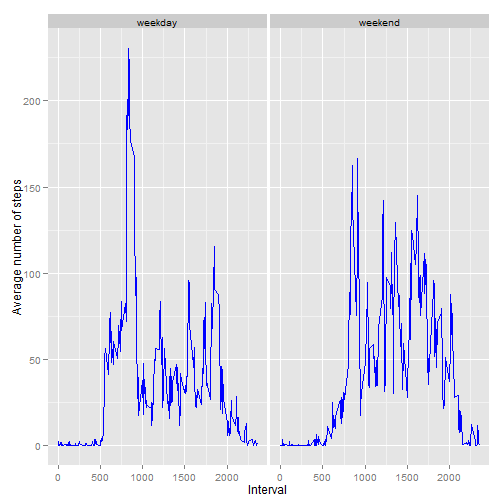

# Reproducible Research: Peer Assessment 1


## Loading and preprocessing the data


```r
library(ggplot2)

data <- read.csv("activity.csv")
totalStepsPerDay <- aggregate(data$steps, by=list(data$date), FUN=sum, na.rm=T)
names(totalStepsPerDay) <- c("date", "steps")
```

## What is mean total number of steps taken per day?

Histogram of the total number of steps taken each day:


```r
hist(totalStepsPerDay$steps, breaks=20, 
     main="Histogram of steps taken each day", 
     xlab="Steps taken per day")
```

 

The mean total number of steps taken per day:


```r
mean(totalStepsPerDay$steps)
```

```
## [1] 9354
```

The median total number of steps taken per day:


```r
median(totalStepsPerDay$steps)
```

```
## [1] 10395
```

## What is the average daily activity pattern?

Computing the average daily pattern:


```r
averageStepsByInterval <- tapply(data$steps, data$interval, mean, na.rm=T)
intervals <- data$interval[data$date == "2012-10-01"]
averageDailyPattern <- data.frame(intervals, averageStepsByInterval)
names(averageDailyPattern) <- c("interval", "steps")
```

Time series plot:


```r
ggplot(averageDailyPattern, aes(interval, steps)) + 
    geom_line(colour="blue") +
    xlab("Interval") + 
    ylab("Average number of steps")
```

 

The interval with the maximum number of steps:


```r
averageDailyPattern$interval[which.max(averageDailyPattern$steps)]
```

```
## [1] 835
```


## Imputing missing values

The number of rows with NAs:


```r
sum(!complete.cases(data))
```

```
## [1] 2304
```

To fill the missing values in the dataset, I will use the mean for the 5-minute
interval:


```r
data.imputed <- data
for (interval in intervals) {
    #get the average number of steps for the current interval
    averageSteps <- 
        averageDailyPattern[averageDailyPattern$interval==interval,]$steps
    #fill in the missing data where NA is present
    data.imputed[data$interval == interval & is.na(data$steps),]$steps <- 
        averageSteps
}

totalStepsPerDay.imputed <- 
    aggregate(data.imputed$steps, by=list(data.imputed$date), FUN=sum)
names(totalStepsPerDay.imputed) <- c("date", "steps")
```

Histogram of the total number of steps taken each day:


```r
hist(totalStepsPerDay.imputed$steps, breaks=20, 
     main="Histogram of steps taken each day", 
     xlab="Steps taken per day")
```

 

The mean total number of steps taken per day:


```r
mean(totalStepsPerDay.imputed$steps)
```

```
## [1] 10766
```

The median total number of steps taken per day:


```r
median(totalStepsPerDay.imputed$steps)
```

```
## [1] 10766
```

Because all the NAs were replaced with average values, the number of days with 0
steps was drastically reduced. The average dominates in the histogram and the mean and median are the same.

## Are there differences in activity patterns between weekdays and weekends?

Creating the weekday factor and adding it to the imputed data frame:


```r
dateToFactor <- function(date) {
    day <- weekdays(date)
    if (day == "Saturday" || day == "Sunday")
        "weekend"
    else
        "weekday"
}
weekdays <- sapply(as.Date(data.imputed$date), dateToFactor)
weekdaysFactor <- as.factor(weekdays)
data.imputed <- cbind(data.imputed, weekdaysFactor)
names(data.imputed) <- c("steps", "date", "interval", "weekday")

dailyPatternByWeekday <- 
    aggregate(steps ~ interval + weekday, data=data.imputed, mean)
```

Plotting the average number of steps for each interval for weekday days and
weekend days:


```r
ggplot(dailyPatternByWeekday, aes(interval, steps)) + 
    facet_grid(. ~ weekday) +
    geom_line(colour="blue") +
    xlab("Interval") + 
    ylab("Average number of steps")
```

 

We can see that the weekdays have a period at noon in which the average number of
steps taken is very high, while the number of steps is more evenly distributed
in the weekend. In the weekend, activities start and end later than in weekdays.
